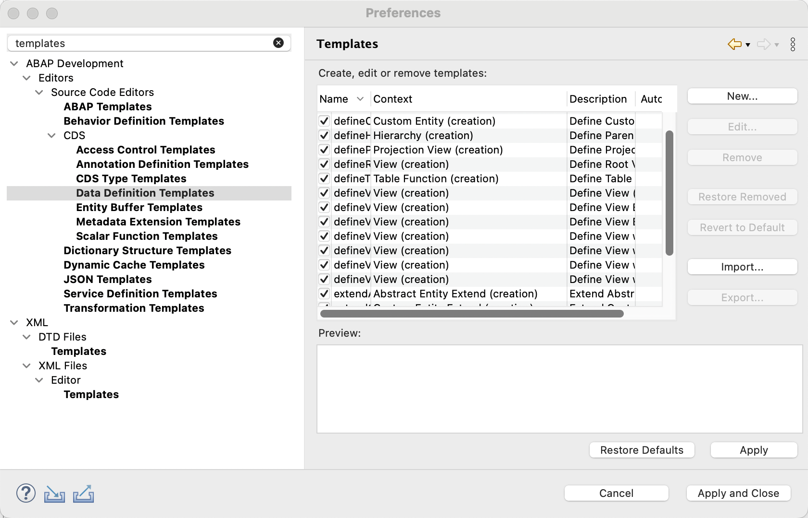

# Get Started

In this exercise, you will create a trial user in the SAP BTP, ABAP Environment. 

## SAP BTP Trial Account

If you have not already done so you have first to register for the SAP BTP Trial [here](https://developers.sap.com/tutorials/abap-environment-trial-onboarding.html).

## ABAP Environment in SAP BTP Trial

The steps to activate the ABAP Environment in the SAP BTP trial by creating an appropriate user are described in the following tutorial.

If you already have an ABAP Environment Trial, please make sure to get a new one as the trial systgems have been updated for the TechEd 2023 sessions!

[Create an SAP BTP ABAP Environment Trial User](https://developers.sap.com/tutorials/abap-environment-trial-onboarding.html)

## Download and install analytical ABAP CDS Templates

As a first task we will start to import templates that we will use in this workshop to create Analytical CDS views such as dimension views, cubes and queries.

**Step 1)** Click on the following link to display the file [analytical_templates.xml](https://github.com/SAP-samples/teched2023-DT187v/blob/main/exercises/ex0/download/analytical_templates.xml)

**Step 2)** Copy the content and save it as an xml-file called **analytical_templates.xml**.

**Step 3)** In ABAP Development Tools, open the preferences and search for 'templates'.

**Step 4)** In Data Definition Templates choose 'Import', then choose your file analytical_templates.xml. 
   

Click to expand!

  
   

  
## Summary

Now that you have onboarded to the SAP BTP Trial, ABAP Environment and saved the analytical CDS templates, you can continue to - [Exercise 1 - Introduction to Analytics in ABAP Cloud](../ex1/README.md)
