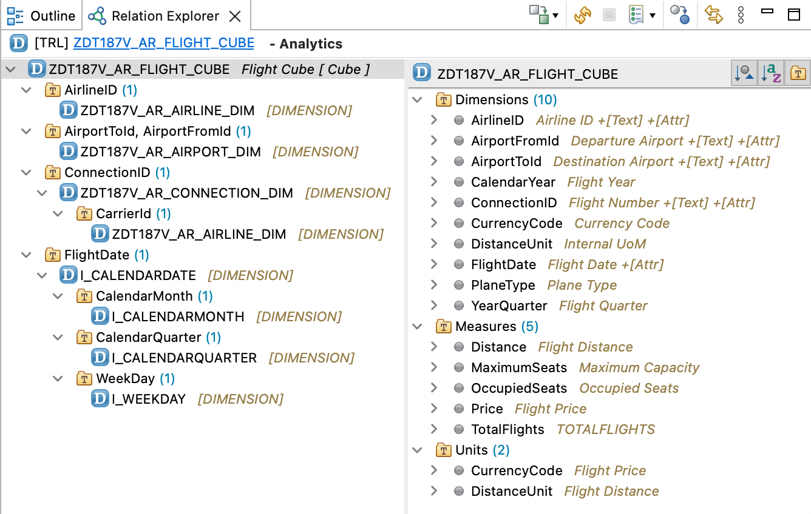

# Exercise 2 - Build a Cube with Dimensions

In this exercise, we will create a cube. The cube is the heart of our analytical model. It draws together all required measures & dimensions and defines the functionality of the analytical model.

The cube view is a `view entity` with the header annotation `@Analytics.dataCategory: #CUBE`.
A dimension view is a `view entity` with the header annotation `@Analytics.dataCategory: #DIMENSION`.

## Exercise 2.1 - Build the Basic Cube

**Step 1)** Create your own sub-package like "ZDT187v_[YourInitials]" underneath ZLOCAL
- add it to your favorite packages
- as transport request create "ZDT187v [YourInitials] Flight Hands-On"

**Step 2)** Create a Cube View in your package.
- Right-click the package and choose<br>
- New -> Other Repository Object -> Core Data Services -> Data Definition<br>
- Click "Next"<br>
- Enter the name "ZDT187v_[YourInitials]_Flight_Cube"<br>
- Give it the description "Flight Cube"<br>
- As Referenced Object, use "/DMO/I_FLIGHT"<br>
- Click "Next"<br>
- Use your request from Step 1
- Click "Next"<br>
- Use the template "Define a View Entity for a Cube" (Prerequisite is that you downloaded and installed the templates)
- Click "Finish"

**Step 3)** Now that you created your first analytical object in the ABAP Development Tools, right-click it in the project explorer, then choose 'Show in' -> 'Relation Explorer'. This perspective is an alternative view to the project explorer that is dedicated to analytical data models.<br>
<br>

**Step 4)** As the annotation inheritance is switched off, you need to manually add the annotation `@Semantics.amount.currencyCode` with the reference to the according currency code field to the price field.

**Step 5)** Press SHIFT+F1 to nicely format your sorce code, then activate the view.<br>
Activating your cube view will raise a warning that your cube does not have an access protection.<br>
Usually you would define an access protection, a so called 'DCL' for the cube. We do not cover this in this hands-on session and will ignore this warning.

<details><summary>Hint: Your code should now look like this</summary><p>

```abap

/* setting the value to #NOT_REQUIRED would remove the warning */
@AccessControl.authorizationCheck: #CHECK
@EndUserText.label: 'Flight Cube'
/* Stopping annotation inheritance can help avoiding confusions */
@Metadata.ignorePropagatedAnnotations: true

/* This header annotation makes the view entity an analytical cube */
@Analytics.dataCategory: #CUBE
@Analytics.internalName: #LOCAL

define view entity ZDT187v_[YourInitials]_Flight_Cube as select from /DMO/I_Flight {
 key AirlineID,
 key ConnectionID,
 key FlightDate,

 @Semantics.amount.currencyCode: 'CurrencyCode'
 Price,

 CurrencyCode,
 PlaneType,
 MaximumSeats,
 OccupiedSeats,

 /* Associations */
 _Airline,
 _Connection
 _Currency
}

```
</p></details>

## Exercise 2.2 - Prepare the Measures

Measures in an analytical cube need to be prepared so that an aggregation can take place when querying. The analytical engine needs an aggregation type as well as the right units and currency codes for quantities and amounts.

**Step 1)** Identify your measures, put them in a suitable order together between the dimensions and the associations.

**Step 2)** Add the annotation `@Aggregation.default` with a suitabble value (either `#SUM`, `#MIN` or `#MAX`) to your measures.

**Step 3)** Add an additional measure that will act as a counter for the flights.
- The expression to be used for this is `cast (1 as abap.int4) as TotalFlights`
- The cast makes sure that the resulting data type is able to count to 2.147.483.647 (without the cast it would have been 256 - a 2 byte integer)
- Give it a suitable aggregation as well

<details><summary>Hint: Your code should now look like this</summary><p>

```abap

@EndUserText.label: 'Flight Cube'
@Metadata.ignorePropagatedAnnotations: true
@AccessControl.authorizationCheck: #NOT_REQUIRED
@Analytics.dataCategory: #CUBE

define view entity ZDT187v_[YourInitials]_Flight_Cube
  as select from /DMO/I_Flight

{
  key AirlineID,

  key ConnectionID,

  key FlightDate,

      PlaneType,

      /* Measures */

      CurrencyCode,
      @Semantics.amount.currencyCode: 'CurrencyCode'
      @Aggregation.default: #MAX
      Price,

      @Aggregation.default: #SUM
      MaximumSeats,

      @Aggregation.default: #SUM
      OccupiedSeats,

      @Aggregation.default: #SUM
      cast (1 as abap.int4) as TotalFlights,

      /* Associations */

      _Airline,
      _Connection
}

```
</p></details>

## Exercise 2.2 - Prepare the Dimensions

The current dimension fields in the cube view are just IDs. In order to be displayed nicely with an according text and with the option to display additional attributes (e.g. the name and city of the airline or the distance or the departure airport of the connection), we need to reference the according dimension views as foreign key references to them. This can not only be done for the key fields of the cube view, but for all dimension fields.

For the airline and the connection, we do already have associations that we took over from /DMO/I_Flight, but these lead to master data views that are not built for the usage as analytical dimensions. Therefore, we will have to replace them. We will also remove the association to the currency view as we don't want to use it.

You will now create the needed dimension views.

| Association Alias | Target | Dimension View |
| --- | --- | --- |
| _Airline | /dmo/carrier (table) | ZDT187v_[YourInitials]_Airline_Dim | 
| _Connection | /dmo/connection (table) | ZDT187v_[YourInitials]_Connection_Dim | 

**Step 1)** Create the dimension view for the Airline.
- Proceed as described in 2.1, step 2 but use the template "Define a View Entity for a Dimension" instead
- Naming and targets, see table above

**Step 2)** Enter the representative key as value of the `@ObjectModel.representativeKey` annotation.<br>
The representative key is the most specific key of your key fields. In our case there is only one key field: CarrierId.

**Step 3)** Enter the Name field as value of the `@ObjectModel.text.element` annotation.<br>
This will improve the usability of your analytical application as the airline name can now be displayed along with the airline id.

**Step 4)** Press SHIFT+F1 to nicely format your sorce code. Then activate the view.

<details><summary>Hint: Your ZDT187v_[YourInitials]_Airline_Dim code should now look like this</summary><p>

```abap

@AccessControl.authorizationCheck: #CHECK
@EndUserText.label: 'Carrier Dimension'
@Metadata.ignorePropagatedAnnotations: true
@Analytics.dataCategory: #DIMENSION
@Analytics.internalName: #LOCAL
@ObjectModel.representativeKey: 'CarrierId'

define view entity ZDT187v_[YourInitials]_Airline_Dim
  as select from /dmo/carrier
{
      @ObjectModel.text.element: ['Name']
  key carrier_id            as CarrierId,
      @Semantics.text: true
      name                  as Name,
      currency_code         as CurrencyCode,
      local_created_by      as LocalCreatedBy,
      local_created_at      as LocalCreatedAt,
      local_last_changed_by as LocalLastChangedBy,
      local_last_changed_at as LocalLastChangedAt,
      last_changed_at       as LastChangedAt
}

```
</p></details>

**Step 5)** Now create the dimension view for the connection in the same way.
- Set the representative Key to 'ConnectionId'.

**Step 6)** Optional: Check the hint to see how a readable text 'Trip' was created and used as text element for the ConnectionId.

<details><summary>Hint: Calculated text element</summary><p>

```abap

//...

  @ObjectModel.text.element: ['Trip']
  key connection_id as ConnectionId,

  //...
  concat(airport_from_id, concat('->', airport_to_id)) as Trip,

//...

```
</p></details>

**Step 7)** Add an association to the Airline dimension that you created before and use it as foreign key association on the AirlineId.
- `association [1] to ZDT187v_[YourInitials]_Airline_Dim as _Airline on $projection.CarrierId = _Airline.CarrierId`
- `@ObjectModel.foreignKey.association: '_Airline'`

**Step 8)** Press SHIFT+F1 to nicely format your sorce code. Then activate the view.

<details><summary>Hint: Your ZDT187v_[YourInitials]_Connection_Dim code should now look like this</summary><p>

```abap

@AccessControl.authorizationCheck: #NOT_REQUIRED
@EndUserText.label: 'Connection Dimension'
@Metadata.ignorePropagatedAnnotations: true
@Analytics.dataCategory: #DIMENSION
@Analytics.internalName: #LOCAL
@ObjectModel.representativeKey: 'ConnectionId'

define view entity ZDT187v_[YourInitials]_Connection_Dim
  as select from /dmo/connection
  association [1] to ZDT187v_[YourInitials]_Airline_Dim as _Airline on $projection.CarrierId = _Airline.CarrierId
{
      @ObjectModel.foreignKey.association: '_Airline'
  key carrier_id                                           as CarrierId,
      @ObjectModel.text.element: ['Trip']
  key connection_id                                        as ConnectionId,
      airport_from_id                                      as AirportFromId,
      airport_to_id                                        as AirportToId,
      concat(airport_from_id, concat('->', airport_to_id)) as Trip,
      departure_time                                       as DepartureTime,
      arrival_time                                         as ArrivalTime,
      distance                                             as Distance,
      distance_unit                                        as DistanceUnit,
      _Airline
}

```
</p></details>

## Exercise 2.3 - Use the Dimensions

Back in your cube view, create associations to the dimension views, expose the associations so that they can finally be used as foreign key reference on your dimension fields.

| Association Alias | Dimension View |
| --- | --- |
| _Airline | ZDT187v_[YourInitials]_Airline_Dim | 
| _Connection | ZDT187v_[YourInitials]_Connection_Dim | 
| _FlightDate | I_CalendarDate | 

**Step 1)** Add an association to the airline dimension you created in Exercise 2.2, Step 1 and expose it as _Airline.

<details><summary>Hint: An association is defined right after the `select from` clause. For the airline dimension, it will look like this</summary><p>

  `association [0..1] to ZDT187v_[YourInitials]_Airline_Dim as _Airline on _Airline.CarrierId = $projection.AirlineID`<br>

</p></details>

**Step 2)** Add an association to the connection dimension that you created in Exercise 2.2, Step 2 in the same way. Expose it as _Connection.
<details><summary>Hint: The association to the connection dimension will look like this</summary><p>

  `association [0..1] to ZDT187v_[YourInitials]_Connection_Dim as _Connection on _Connection.CarrierId = $projection.AirlineID and _Connection.ConnectionId = $projection.ConnectionID`

</p></details>

**Step 3)** Add an association to the dimension I_CalendarDate in the same way. Expose it by adding its alias _FlightDate to the element list.

<details><summary>Hint: The association to I_CalendarDate will look like this</summary><p>

  `association [0..1] to I_CalendarDate as _FlightDate on _FlightDate.CalendarDate = $projection.FlightDate`

</p></details>

**Step 4)** Add the associations you just introduced as foreign key relations to your dimension key fields by using the annotation `@ObjectModel.foreignKey.association`. As value, choose the alias of the exposed association.

**Step 5)** Press SHIFT+F1 to nicely format your sorce code. Then activate the view.

<details><summary>Hint: Your cube code should now look like this</summary><p>

```abap

@EndUserText.label: 'Flight Cube'
@Metadata.ignorePropagatedAnnotations: true
@AccessControl.authorizationCheck: #NOT_REQUIRED
@Analytics.dataCategory: #CUBE

define view entity ZDT187v_[YourInitials]_Flight_Cube
  as select from /DMO/I_Flight
  association [0..1] to ZDT187v_[YourInitials]_Airline_Dim    as _Airline     on  _Airline.CarrierId       = $projection.AirlineID
  association [0..1] to ZDT187v_[YourInitials]_Connection_Dim as _Connection  on  _Connection.CarrierId    = $projection.AirlineID
                                                                              and _Connection.ConnectionId = $projection.ConnectionID
  association [0..1] to I_CalendarDate         as _FlightDate  on  _FlightDate.CalendarDate = $projection.FlightDate

{
      @ObjectModel.foreignKey.association: '_Airline'
  key AirlineID,

      @ObjectModel.foreignKey.association: '_Connection'
  key ConnectionID,

      @ObjectModel.foreignKey.association: '_FlightDate'
  key FlightDate,

      PlaneType,

      /* Measures */

      CurrencyCode,

      @Semantics.amount.currencyCode: 'CurrencyCode'
      @Aggregation.default: #MAX
      Price,

      @Aggregation.default: #SUM
      MaximumSeats,

      @Aggregation.default: #SUM
      OccupiedSeats,

      @Aggregation.default: #SUM
      cast (1 as abap.int4) as TotalFlights,

      /* Associations for Dimensions */

      _Airline,
      _Connection,
      _FlightDate
}

```
</p></details>

## Exercise 2.3 - Optional: Add and use additional Dimensions

The cube that we have prepared now is ready to be used, but we want to add some additional functionality to it in terms of dimensions that we later can aggregate by.
Even though we have added dimension views that give us access to additional display attributes like the departure or arrival airport of the destination or the month and quarter of the flight date, we would not be able to use these attributes as criteria to aggregate by. Every field that we want to use as aggregation criteria later on has to be an element of the cube view.
Therefore, we will now use the associations to the dimensions to add those fields directly to the cube. 

If you are in a hurry, continue to - [Exercise 3 - Build a Cube ](../ex3/README.md) as the optional exercise will take some time.


**Step 1)** Optional: Use the _Connection association to add target and destiantion airport as dimensions

<details><summary>Hint</summary><p>

```abap

define view entity ZDT187v_[YourInitials]_Flights_Cube
//...
{
      //...
      _Connection.AirportFromId,
      _Connection.AirportToId,
      /...
}

```
</p></details>

**Step 2)** Optional: Create an additional dimension view ZDT187v_[YourInitials]_Airport_Dim.
- Proceed as described in Exercise 2.1, Step 2
- choose /dmo/airport as the referenced data source
- use the template "Define a View Entity for a Dimension"
- fill in the representative key and text element
- Press SHIFT+F1 to nicely format your sorce code. Then activate the view

<details><summary>Hint: Your ZDT187v_[YourInitials]_Airport_Dim code should now look like this</summary><p>

```abap

@AccessControl.authorizationCheck: #CHECK
@EndUserText.label: 'Airport Dimension'
@Metadata.ignorePropagatedAnnotations: true
@Analytics.internalName: #LOCAL
@Analytics.dataCategory: #DIMENSION
@ObjectModel.representativeKey: 'AirportId'

define view entity ZDT187v_[YourInitials]_Airport_Dim
  as select from /dmo/airport
{
      @ObjectModel.text.element: ['Name']
  key airport_id as AirportId,
      name       as Name,
      city       as City,
      country    as Country
}

```
</p></details>

**Step 3)** Optional: Use the new dimension view in your cube.
- Add two associations to the new dimension in your cube view
   - one for the origin airport `as _AirportFrom` 
   - another one for the destination airport `as _AirportTo`
- expose both
- and use them as foreign key reference for the AirportFrom and the AirportTo field  

<details><summary>Hint</summary><p>

```abap

define view entity ZDT187v_[YourInitials]_Flights_Cube
//...
  association [0..1] to ZDT187v_[YourInitials]_Airport_Dim as _AirportFrom on _AirportFrom.AirportId = $projection.AirportFromId
  association [0..1] to ZDT187v_[YourInitials]_Airport_Dim as _AirportTo on _AirportTo.AirportId = $projection.AirportToId
{
      //...
      @ObjectModel.foreignKey.association: '_AirportFrom'
      _Connection.AirportFromId,

      @ObjectModel.foreignKey.association: '_AirportTo'
      _Connection.AirportToId,

      /...
      _AirportFrom,
      _AirportTo,
      /...
}

```
</p></details>


**Step 4)** Optional:  Sometimes, dimensions can also include measures. To be able to analyse and aggregate them, they need to be part of the cube as well.<br>
Use the _Connection association to add the flight distance together with the distance unit as additional measure.
- As the distance is an amount with a unit, you need to add `@Semantics.quantity.unitOfMeasure: 'DistanceUnit'` to it
- as well as a suitable aggregation, e.g. `@Aggregation.default: #MAX`

<details><summary>Hint</summary><p>

```abap

define view entity ZDT187v_[YourInitials]_Flights_Cube
//...
{
      //...
      _Connection.DistanceUnit,

      @Semantics.quantity.unitOfMeasure: 'DistanceUnit'
      @Aggregation.default: #MAX
      _Connection.Distance,

      /...
}

```
</p></details>


**Step 5)** Optional:  Use the _FlightDate association to add the flight quarter as well as the flight year as dimensions.
- Add a label e.g. `@EndUserText.label: 'Flight Year'` to the field to give it a readable name
- Explain the analytical engine that the field is a calendar year by setting `@Semantics.calendar.year: true`<br>
  This will enable additional display attributes in the UI later on.
- Finally set the fields in relation to the Flight Date with `@ObjectModel.value.derivedFrom: [ 'FlightDate' ]`<br>
  This is again a hint for the analytical engine and is especially important if multiple dates are in your model.

<details><summary>Hint</summary><p>

```abap

define view entity ZDT187v_[YourInitials]_Flights_Cube
//...
{
      //...
      @EndUserText.label: 'Flight Quarter'
      @Semantics.calendar.yearQuarter: true
      @ObjectModel.value.derivedFrom: [ 'FlightDate' ]
      _FlightDate.YearQuarter,

      @EndUserText.label: 'Flight Year'
      @Semantics.calendar.year: true
      @ObjectModel.value.derivedFrom: [ 'FlightDate' ]
      _FlightDate.CalendarYear,
      /...
}

```
</p></details>

**Step 6)** Press SHIFT+F1 to nicely format your sorce code. Then activate the view.

## Summary

You have now learned what measures and dimensions are and how to build an analytical cube view. The cube is the center of the analytical data model and the so called star schema.
The cube defines the capabilities of your analytical model and draws together all measures and dimensions. Every dimension that you later want to aggregate by needs to be part of the cube view.
Calculations that have to happen before the aggregation (like the counter that you introduced) have to happen in the cube as well.

<details><summary>Hint: Your final cube view should now look like this</summary><p>

```abap

@AccessControl.authorizationCheck: #CHECK
@EndUserText.label: 'Flight Cube'
@Metadata.ignorePropagatedAnnotations: true
@Analytics.dataCategory: #CUBE
@Analytics.internalName: #LOCAL

define view entity ZDT187v_[YourInitials]_Flights_Cube
  as select from /DMO/I_Flight
  association [0..1] to ZDT187v_[YourInitials]_Airline_Dim    as _Airline     on  _Airline.CarrierId       = $projection.AirlineID
  association [0..1] to ZDT187v_[YourInitials]_Connection_Dim as _Connection  on  _Connection.CarrierId    = $projection.AirlineID
                                                                              and _Connection.ConnectionId = $projection.ConnectionID
  association [0..1] to I_CalendarDate                        as _FlightDate  on  _FlightDate.CalendarDate = $projection.FlightDate
  /* start optional associations */
  association [0..1] to ZDT187v_[YourInitials]_Airport_Dim    as _AirportFrom on  _AirportFrom.AirportId   = $projection.AirportFromId
  association [0..1] to ZDT187v_[YourInitials]_Airport_Dimn   as _AirportTo   on  _AirportTo.AirportId     = $projection.AirportToId
  /* end optional associations */
{
      @ObjectModel.foreignKey.association: '_Airline'
  key AirlineID,

      @ObjectModel.foreignKey.association: '_Connection'
  key ConnectionID,

      @ObjectModel.foreignKey.association: '_FlightDate'
  key FlightDate,

      PlaneType,

      /* start optional dimensions */
      @ObjectModel.foreignKey.association: '_AirportFrom'
      _Connection.AirportFromId,

      @ObjectModel.foreignKey.association: '_AirportTo'
      _Connection.AirportToId,

      @EndUserText.label: 'Flight Quarter'
      @Semantics.calendar.yearQuarter: true
      @ObjectModel.value.derivedFrom: [ 'FlightDate' ]
      _FlightDate.YearQuarter,

      @EndUserText.label: 'Flight Year'
      @Semantics.calendar.year: true
      @ObjectModel.value.derivedFrom: [ 'FlightDate' ]
      _FlightDate.CalendarYear,
      /* end optional dimensions */

      /* Measures */

      CurrencyCode,

      @Semantics.amount.currencyCode: 'CurrencyCode'
      @Aggregation.default: #MAX
      Price,

      @Aggregation.default: #SUM
      MaximumSeats,

      @Aggregation.default: #SUM
      OccupiedSeats,

      @Aggregation.default: #SUM
      cast (1 as abap.int4) as TotalFlights,

      _Connection.DistanceUnit,

      /* start optional measure */
      @Semantics.quantity.unitOfMeasure: 'DistanceUnit'
      @Aggregation.default: #MAX
      _Connection.Distance,
      /* end optional measure */


      /* Associations for Dimensions */

      _Airline,
      _Connection,

      /* start optional associations */
      _AirportFrom,
      _AirportTo,
      _FlightDate
      /* end optional associations */
}

```
</p></details>

Continue to - [Exercise 3 - Build a Query ](../ex3/README.MD)
